---
jupyter:
  kernelspec:
    display_name: Python 3 (ipykernel)
    language: python
    name: python3
  language_info:
    codemirror_mode:
      name: ipython
      version: 3
    file_extension: .py
    mimetype: text/x-python
    name: python
    nbconvert_exporter: python
    pygments_lexer: ipython3
    version: 3.8.10
  nbformat: 4
  nbformat_minor: 5
---

::: {.cell .markdown}
# PJI Mesure de la consommation énergétique de Flower
:::

::: {.cell .code execution_count="62"}
``` {.python}
import pandas as pd
import matplotlib.pyplot as plt
import numpy as np
import locale
locale.setlocale(locale.LC_NUMERIC, 'fr_FR.UTF-8')
```

::: {.output .execute_result execution_count="62"}
    'fr_FR.UTF-8'
:::
:::

::: {.cell .code execution_count="63"}
``` {.python}
def graphes(client, serveur):
    df_client = pd.DataFrame(client)
    df_serveur = pd.DataFrame(serveur)

    tours = list(range(0,len(df_client)//2))

    # CLients
    y_client1 = list(df_client['uncore_0'][::2])
    y_client2 = list(df_client['uncore_0'][1::2])

    fit_client1_params = np.polyfit(tours, y_client1, 4)
    fit_client1 = np.poly1d(fit_client1_params)
    mean_client1 = np.mean(y_client1)

    fit_client2_params = np.polyfit(tours, y_client2, 4)
    fit_client2 = np.poly1d(fit_client1_params)
    mean_client2 = np.mean(y_client2)


    # Serveur    

    y_serveur = list(df_serveur['uncore_0'])[:len(df_serveur)]


    fit_serveur_params = np.polyfit(tours, y_serveur, 4)
    fit_serveur = np.poly1d(fit_serveur_params)

    mean_serveur = np.mean(y_serveur)


    print("La Moyenne d'énergie dépensée par le client 1 est de : ", "{:,}".format(round(mean_client1,2)), "Joules")
    print("La Moyenne d'énergie dépensée par le client 2 est de : ", "{:,}".format(round(mean_client2,2)), "Joules")
    print("La Moyenne d'énergie dépensée par le serveur est de : ", "{:,}".format(round(mean_serveur,2)), "Joules")

    plt.title("Energie dépensée")
    plt.xlabel("Tours")
    plt.ylabel("Energie (J)")

    # Show the plot
    plt.plot(tours,y_client1, "g", label="client 1")
    plt.plot(tours,y_client2, "b", label="client 2")
    plt.plot(tours,y_serveur, "r", label="serveur")

    plt.title("Energie dépensée")
    plt.xlabel("Tours")
    plt.ylabel("Energie (J)")

    plt.legend()
    plt.show()


    plt.title("Energie dépensée")
    plt.xlabel("Tours")
    plt.ylabel("Energie (J)")

    plt.plot(tours,y_client1, "g", alpha=0.5)
    plt.plot(tours,y_client2, "b", alpha=0.5)
    plt.plot(tours,y_serveur, "r", alpha=0.5)

    plt.plot(tours,fit_client1(tours), "g", linewidth=4,  label="Fit client 1")
    plt.plot(tours,fit_client2(tours), "b", linewidth=4,  label="Fit client 2")
    plt.plot(tours,fit_serveur(tours), "r", linewidth=4,  label="Fit serveur")

    plt.legend()
    plt.show()
```
:::

::: {.cell .markdown}
La fonction **graphes(client, serveur)** permet de récupérer les
informations des fichiers csv sur la consommation énergétique côté
client et serveur.
:::

::: {.cell .markdown}
Les fichiers csv sont rangés dans des dossiers ayant pour nom l\'outil
d\'apprentissage et le dataset utilisé.\
A l\'intérieur de ces dossiers, il peut y avoir plusieurs fichiers csv,
ils sont rangés en fonction de la modification des paramètres.
:::

::: {.cell .markdown}
### Tensorflow + Cifar10 {#tensorflow--cifar10}
:::

::: {.cell .code execution_count="64"}
``` {.python}
client = pd.read_csv("tensorflow_cifar10/result_client.csv",sep=';', usecols=['duration','package_0','core_0','uncore_0'])
serveur = pd.read_csv("tensorflow_cifar10/result_server.csv",';', usecols=['duration','package_0','core_0','uncore_0'])[:len(client)//2]

graphes(client, serveur)
```

::: {.output .stream .stderr}
    /home/hippo/.local/lib/python3.8/site-packages/IPython/core/interactiveshell.py:3398: FutureWarning: In a future version of pandas all arguments of read_csv except for the argument 'filepath_or_buffer' will be keyword-only.
      exec(code_obj, self.user_global_ns, self.user_ns)
:::

::: {.output .stream .stdout}
    La Moyenne d'énergie dépensée par le client 1 est de :  9,178,604.5 Joules
    La Moyenne d'énergie dépensée par le client 2 est de :  9,179,156.65 Joules
    La Moyenne d'énergie dépensée par le serveur est de :  10,202,084.67 Joules
:::

::: {.output .display_data}
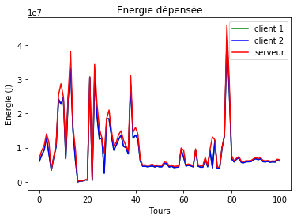
:::

::: {.output .display_data}
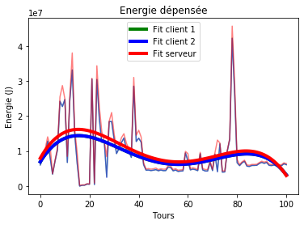
:::
:::

::: {.cell .markdown}
Ci-dessus c\'est l\'outil **Tensorflow** qui est utilisé avec le dataset
**Cifar10**.

On peut voir que la moyenne de consommation pour les clients est
d\'environ 9 MJ, et pour le serveur de 10 MJ. Les courbes de suivi de
tendance (Fit) côté client sont superposées, et suivent le même tracé
que celle côté serveur en restant inférieures.
:::

::: {.cell .markdown}
Nous allons ensuite changer quelques paramètres côté client pour
observer ceux qui influent directement sur la consommation énergétique.

Ci-dessous nous allons passer le nombre de **classes** de 10 à 100.
:::

::: {.cell .code execution_count="65"}
``` {.python}
client = pd.read_csv("tensorflow_cifar10/result_client_classes_100.csv",';', usecols=['duration','package_0','core_0','uncore_0'])
serveur = pd.read_csv("tensorflow_cifar10/result_server.csv",';', usecols=['duration','package_0','core_0','uncore_0'])[102:102+len(client)//2]

graphes(client,serveur)
```

::: {.output .stream .stderr}
    /home/hippo/.local/lib/python3.8/site-packages/IPython/core/interactiveshell.py:3398: FutureWarning: In a future version of pandas all arguments of read_csv except for the argument 'filepath_or_buffer' will be keyword-only.
      exec(code_obj, self.user_global_ns, self.user_ns)
    /home/hippo/.local/lib/python3.8/site-packages/IPython/core/interactiveshell.py:3398: FutureWarning: In a future version of pandas all arguments of read_csv except for the argument 'filepath_or_buffer' will be keyword-only.
      exec(code_obj, self.user_global_ns, self.user_ns)
:::

::: {.output .stream .stdout}
    La Moyenne d'énergie dépensée par le client 1 est de :  4,273,741.15 Joules
    La Moyenne d'énergie dépensée par le client 2 est de :  4,275,103.97 Joules
    La Moyenne d'énergie dépensée par le serveur est de :  4,593,659.91 Joules
:::

::: {.output .display_data}
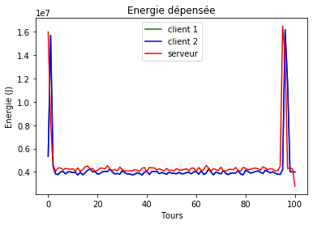
:::

::: {.output .display_data}
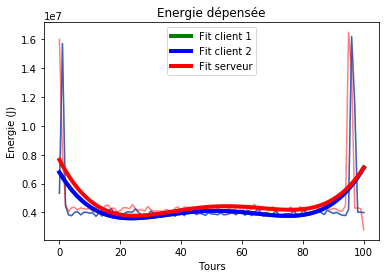
:::
:::

::: {.cell .markdown}
On peut observer que la consommation a largement réduit. La moyenne est
passée de 9 MJ à 4,27 MJ côté client, et 10 MJ à 4,59 MJ côté serveur.

Le nombre de classes influe donc sur la consommation énergétique.
:::

::: {.cell .markdown}
On passe ensuite le ***batch_size*** de 32 à 64. Et on garde le nombre
de classes à 10 pour toujours comparer à la consommation initiale.
:::

::: {.cell .code execution_count="66"}
``` {.python}
client = pd.read_csv("tensorflow_cifar10/result_client_batch_size_64.csv",';', usecols=['duration','package_0','core_0','uncore_0'])
serveur = pd.read_csv("tensorflow_cifar10/result_server.csv",';', usecols=['duration','package_0','core_0','uncore_0'])[102*2:102*2+len(client)//2]

graphes(client,serveur)
```

::: {.output .stream .stderr}
    /home/hippo/.local/lib/python3.8/site-packages/IPython/core/interactiveshell.py:3398: FutureWarning: In a future version of pandas all arguments of read_csv except for the argument 'filepath_or_buffer' will be keyword-only.
      exec(code_obj, self.user_global_ns, self.user_ns)
    /home/hippo/.local/lib/python3.8/site-packages/IPython/core/interactiveshell.py:3398: FutureWarning: In a future version of pandas all arguments of read_csv except for the argument 'filepath_or_buffer' will be keyword-only.
      exec(code_obj, self.user_global_ns, self.user_ns)
:::

::: {.output .stream .stdout}
    La Moyenne d'énergie dépensée par le client 1 est de :  1,750,852.17 Joules
    La Moyenne d'énergie dépensée par le client 2 est de :  1,754,853.9 Joules
    La Moyenne d'énergie dépensée par le serveur est de :  2,071,664.03 Joules
:::

::: {.output .display_data}
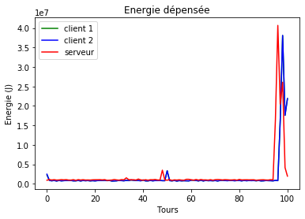
:::

::: {.output .display_data}
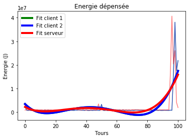
:::
:::

::: {.cell .markdown}
On voit ici aussi que la consommation à nettement baissée, la moyenne
passe de 9 MJ à 1,75 MJ côté client et 10 MJ à 2 MJ côté serveur.
:::

::: {.cell .markdown}
Le dernier test avec cette configuration (**Tensorflow + Cifar10**) est
fait en modifiant le paramètre ***epochs***, en le passant de 1 à 5.
:::

::: {.cell .code execution_count="67"}
``` {.python}
client = pd.read_csv("tensorflow_cifar10/result_client_epochs_5.csv",';', usecols=['duration','package_0','core_0','uncore_0'])[:-6]
serveur = pd.read_csv("tensorflow_cifar10/result_server.csv",';', usecols=['duration','package_0','core_0','uncore_0'])[102*3:]

graphes(client,serveur)
```

::: {.output .stream .stderr}
    /home/hippo/.local/lib/python3.8/site-packages/IPython/core/interactiveshell.py:3398: FutureWarning: In a future version of pandas all arguments of read_csv except for the argument 'filepath_or_buffer' will be keyword-only.
      exec(code_obj, self.user_global_ns, self.user_ns)
    /home/hippo/.local/lib/python3.8/site-packages/IPython/core/interactiveshell.py:3398: FutureWarning: In a future version of pandas all arguments of read_csv except for the argument 'filepath_or_buffer' will be keyword-only.
      exec(code_obj, self.user_global_ns, self.user_ns)
:::

::: {.output .stream .stdout}
    La Moyenne d'énergie dépensée par le client 1 est de :  1,604,047.33 Joules
    La Moyenne d'énergie dépensée par le client 2 est de :  1,605,386.65 Joules
    La Moyenne d'énergie dépensée par le serveur est de :  1,933,608.05 Joules
:::

::: {.output .display_data}
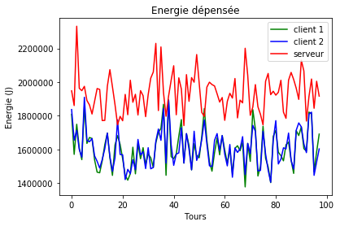
:::

::: {.output .display_data}
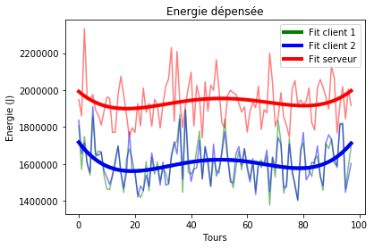
:::
:::

::: {.cell .markdown}
Pour ce dernier test, on constate que la consommation fluctue énormément
des deux côtés. Les deux courbes se suivent mais la consommation du
serveur reste toujours plus élevée. La moyenne diminue quand même et
passe de 9 MJ à 1,6 MJ pour les clients, et de 10 MJ à 1,9 MJ pour le
serveur.
:::

::: {.cell .markdown tags="[]"}
### Pytorch + Cifar10 {#pytorch--cifar10}
:::

::: {.cell .markdown}
On passe maintenant à l\'outil Pytorch, en gardant le dataset Cifar10.\
On utilise les paramètres donnés initialement.
:::

::: {.cell .code execution_count="68"}
``` {.python}
client = pd.read_csv("pytorch_cifar10/result_client.csv",';', usecols=['duration','package_0','core_0','uncore_0'])
serveur = pd.read_csv("pytorch_cifar10/result_server.csv",';', usecols=['duration','package_0','core_0','uncore_0'])[:len(client)//2]

graphes(client,serveur)
```

::: {.output .stream .stderr}
    /home/hippo/.local/lib/python3.8/site-packages/IPython/core/interactiveshell.py:3398: FutureWarning: In a future version of pandas all arguments of read_csv except for the argument 'filepath_or_buffer' will be keyword-only.
      exec(code_obj, self.user_global_ns, self.user_ns)
    /home/hippo/.local/lib/python3.8/site-packages/IPython/core/interactiveshell.py:3398: FutureWarning: In a future version of pandas all arguments of read_csv except for the argument 'filepath_or_buffer' will be keyword-only.
      exec(code_obj, self.user_global_ns, self.user_ns)
:::

::: {.output .stream .stdout}
    La Moyenne d'énergie dépensée par le client 1 est de :  28,852,192.15 Joules
    La Moyenne d'énergie dépensée par le client 2 est de :  28,774,760.89 Joules
    La Moyenne d'énergie dépensée par le serveur est de :  29,255,704.75 Joules
:::

::: {.output .display_data}
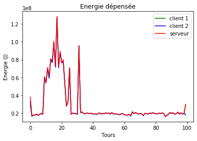
:::

::: {.output .display_data}
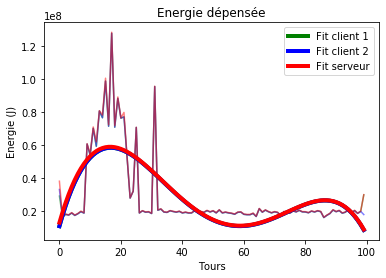
:::
:::

::: {.cell .markdown}
On note ici que la consommation est beaucoup plus élevée que pour
Tensorflow, la moyenne du client est de 28,85 MJ, et celle du serveur
est de 29,25 MJ. Les courbes sont presque identiques.
:::

::: {.cell .markdown}
Le premier paramètre que l\'on modifie est l\'***epochs***, on le passe
de 1 à 5.
:::

::: {.cell .code execution_count="69"}
``` {.python}
client = pd.read_csv("pytorch_cifar10/result_client_epochs_5.csv",';', usecols=['duration','package_0','core_0','uncore_0'])[:-1]
serveur = pd.read_csv("pytorch_cifar10/result_server.csv",';', usecols=['duration','package_0','core_0','uncore_0'])[100:100+len(client)//2]

graphes(client,serveur)
```

::: {.output .stream .stderr}
    /home/hippo/.local/lib/python3.8/site-packages/IPython/core/interactiveshell.py:3398: FutureWarning: In a future version of pandas all arguments of read_csv except for the argument 'filepath_or_buffer' will be keyword-only.
      exec(code_obj, self.user_global_ns, self.user_ns)
    /home/hippo/.local/lib/python3.8/site-packages/IPython/core/interactiveshell.py:3398: FutureWarning: In a future version of pandas all arguments of read_csv except for the argument 'filepath_or_buffer' will be keyword-only.
      exec(code_obj, self.user_global_ns, self.user_ns)
:::

::: {.output .stream .stdout}
    La Moyenne d'énergie dépensée par le client 1 est de :  49,278,128.72 Joules
    La Moyenne d'énergie dépensée par le client 2 est de :  48,861,239.77 Joules
    La Moyenne d'énergie dépensée par le serveur est de :  49,791,327.67 Joules
:::

::: {.output .display_data}
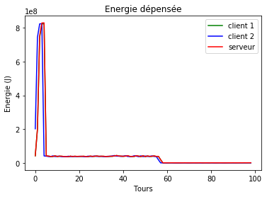
:::

::: {.output .display_data}
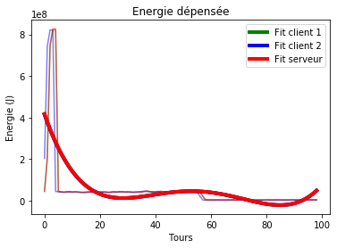
:::
:::

::: {.cell .markdown}
On constate ici aussi que la consommation est beaucoup plus élevée, la
moyenne passe à 49 MJ pour les clients et le serveur.
:::

::: {.cell .markdown}
Les paramètres sont réinitialisés avant de modifier le ***batch_size***
de 32 à 64.
:::

::: {.cell .code execution_count="70"}
``` {.python}
client = pd.read_csv("pytorch_cifar10/result_client_batch_size_64.csv",';', usecols=['duration','package_0','core_0','uncore_0'])[:-1]
serveur = pd.read_csv("pytorch_cifar10/result_server.csv",';', usecols=['duration','package_0','core_0','uncore_0'])[201:]

graphes(client,serveur)
```

::: {.output .stream .stderr}
    /home/hippo/.local/lib/python3.8/site-packages/IPython/core/interactiveshell.py:3398: FutureWarning: In a future version of pandas all arguments of read_csv except for the argument 'filepath_or_buffer' will be keyword-only.
      exec(code_obj, self.user_global_ns, self.user_ns)
    /home/hippo/.local/lib/python3.8/site-packages/IPython/core/interactiveshell.py:3398: FutureWarning: In a future version of pandas all arguments of read_csv except for the argument 'filepath_or_buffer' will be keyword-only.
      exec(code_obj, self.user_global_ns, self.user_ns)
:::

::: {.output .stream .stdout}
    La Moyenne d'énergie dépensée par le client 1 est de :  18,236,460.57 Joules
    La Moyenne d'énergie dépensée par le client 2 est de :  18,143,500.96 Joules
    La Moyenne d'énergie dépensée par le serveur est de :  18,695,297.11 Joules
:::

::: {.output .display_data}
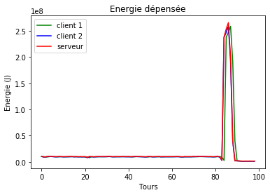
:::

::: {.output .display_data}
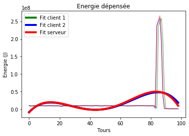
:::
:::

::: {.cell .markdown}
Ici la consommation énergétique diminue très fortement par rapport aux
essais précédents. La moyenne est maintenant d\'environ 18 MJ.
:::

::: {.cell .markdown}
Avec ces différents essais, on peut conclure que l\'outil Tensorflow est
largement moins énergivore que Pytorch, peu importe les paramètres.\
On peut ajouter que le paramètre qui fait économiser le plus d\'énergie
est le ***batch_size***, on l\'a fait passer de 32 à 64 avec les
différents outils, et il permet de moins consommer d\'énergie.
:::

::: {.cell .markdown}
### Tensorflow + Mnist {#tensorflow--mnist}
:::

::: {.cell .markdown}
On réessaye maintenant avec l\'outil **Tensorflow**, mais avec le
dataset **mnist**.
:::

::: {.cell .code execution_count="71"}
``` {.python}
def graphes2(client1, client2, serveur):
    df_client1 = pd.DataFrame(client1)
    df_client2 = pd.DataFrame(client2)
    df_serveur = pd.DataFrame(serveur)

    tours = list(range(0,len(df_client1)))

    # CLients
    y_client1 = list(df_client1['uncore_0'])
    y_client2 = list(df_client2['uncore_0'])
    
    print(len(y_client1),len(y_client2),len(tours))
    
    fit_client1_params = np.polyfit(tours, y_client1, 4)
    fit_client1 = np.poly1d(fit_client1_params)
    mean_client1 = np.mean(y_client1)

    fit_client2_params = np.polyfit(tours, y_client2, 4)
    fit_client2 = np.poly1d(fit_client1_params)
    mean_client2 = np.mean(y_client2)


    # Serveur    

    y_serveur = list(df_serveur['uncore_0'])[:len(df_serveur)]


    fit_serveur_params = np.polyfit(tours, y_serveur, 4)
    fit_serveur = np.poly1d(fit_serveur_params)

    mean_serveur = np.mean(y_serveur)


    print("La Moyenne d'énergie dépensée par le client 1 est de : ", "{:,}".format(round(mean_client1,2)), "Joules")
    print("La Moyenne d'énergie dépensée par le client 2 est de : ", "{:,}".format(round(mean_client2,2)), "Joules")
    print("La Moyenne d'énergie dépensée par le serveur est de : ", "{:,}".format(round(mean_serveur,2)), "Joules")

    plt.title("Energie dépensée")
    plt.xlabel("Tours")
    plt.ylabel("Energie (J)")

    # Show the plot
    plt.plot(tours,y_client1, "g", label="client 1")
    plt.plot(tours,y_client2, "b", label="client 2")
    plt.plot(tours,y_serveur, "r", label="serveur")

    plt.title("Energie dépensée")
    plt.xlabel("Tours")
    plt.ylabel("Energie (J)")

    plt.legend()
    plt.show()


    plt.title("Energie dépensée")
    plt.xlabel("Tours")
    plt.ylabel("Energie (J)")

    plt.plot(tours,y_client1, "g", alpha=0.5)
    plt.plot(tours,y_client2, "b", alpha=0.5)
    plt.plot(tours,y_serveur, "r", alpha=0.5)

    plt.plot(tours,fit_client1(tours), "g", linewidth=4,  label="Fit client 1")
    plt.plot(tours,fit_client2(tours), "b", linewidth=4,  label="Fit client 2")
    plt.plot(tours,fit_serveur(tours), "r", linewidth=4,  label="Fit serveur")

    plt.legend()
    plt.show()
    
```
:::

::: {.cell .code execution_count="72"}
``` {.python}
client1 = pd.read_csv("tensorflow_mnist/result_client1.csv",';', usecols=['duration','package_0','core_0','uncore_0'])
client2 = pd.read_csv("tensorflow_mnist/result_client2.csv",';', usecols=['duration','package_0','core_0','uncore_0'])

serveur = pd.read_csv("tensorflow_mnist/result_server.csv",';', usecols=['duration','package_0','core_0','uncore_0'])[:len(client1)]

graphes2(client1, client2, serveur)
```

::: {.output .stream .stderr}
    /home/hippo/.local/lib/python3.8/site-packages/IPython/core/interactiveshell.py:3398: FutureWarning: In a future version of pandas all arguments of read_csv except for the argument 'filepath_or_buffer' will be keyword-only.
      exec(code_obj, self.user_global_ns, self.user_ns)
    /home/hippo/.local/lib/python3.8/site-packages/IPython/core/interactiveshell.py:3398: FutureWarning: In a future version of pandas all arguments of read_csv except for the argument 'filepath_or_buffer' will be keyword-only.
      exec(code_obj, self.user_global_ns, self.user_ns)
    /home/hippo/.local/lib/python3.8/site-packages/IPython/core/interactiveshell.py:3398: FutureWarning: In a future version of pandas all arguments of read_csv except for the argument 'filepath_or_buffer' will be keyword-only.
      exec(code_obj, self.user_global_ns, self.user_ns)
:::

::: {.output .stream .stdout}
    310 310 310
    La Moyenne d'énergie dépensée par le client 1 est de :  625,809.29 Joules
    La Moyenne d'énergie dépensée par le client 2 est de :  627,023.04 Joules
    La Moyenne d'énergie dépensée par le serveur est de :  1,543,416.89 Joules
:::

::: {.output .display_data}
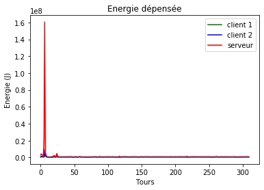
:::

::: {.output .display_data}
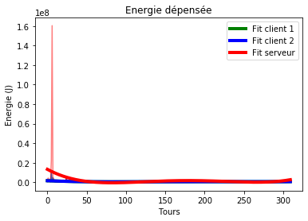
:::
:::

::: {.cell .markdown}
La consommation est ici largement inférieure aux précédentes,la moyenne
des clients est de 626 kJ, et celle du serveur est de 1.5 MJ. La
consommation du serveur est deux fois plus élevée que celle des clients,
mais reste convenable par rapport aux précédents tests.
:::

::: {.cell .markdown}
Toujours avec le dataset **mnist** et Tensorflow, on modifie
l\'***epochs*** de 1 à 5.
:::

::: {.cell .code execution_count="73"}
``` {.python}
client1 = pd.read_csv("tensorflow_mnist/result_client1_epochs_5.csv",';', usecols=['duration','package_0','core_0','uncore_0'])
client2 = pd.read_csv("tensorflow_mnist/result_client2_epochs_5.csv",';', usecols=['duration','package_0','core_0','uncore_0'])

serveur = pd.read_csv("tensorflow_mnist/result_server.csv",';', usecols=['duration','package_0','core_0','uncore_0'])[310:]

graphes2(client1, client2, serveur)
```

::: {.output .stream .stderr}
    /home/hippo/.local/lib/python3.8/site-packages/IPython/core/interactiveshell.py:3398: FutureWarning: In a future version of pandas all arguments of read_csv except for the argument 'filepath_or_buffer' will be keyword-only.
      exec(code_obj, self.user_global_ns, self.user_ns)
    /home/hippo/.local/lib/python3.8/site-packages/IPython/core/interactiveshell.py:3398: FutureWarning: In a future version of pandas all arguments of read_csv except for the argument 'filepath_or_buffer' will be keyword-only.
      exec(code_obj, self.user_global_ns, self.user_ns)
    /home/hippo/.local/lib/python3.8/site-packages/IPython/core/interactiveshell.py:3398: FutureWarning: In a future version of pandas all arguments of read_csv except for the argument 'filepath_or_buffer' will be keyword-only.
      exec(code_obj, self.user_global_ns, self.user_ns)
:::

::: {.output .stream .stdout}
    300 300 300
    La Moyenne d'énergie dépensée par le client 1 est de :  856,421.1 Joules
    La Moyenne d'énergie dépensée par le client 2 est de :  854,122.58 Joules
    La Moyenne d'énergie dépensée par le serveur est de :  1,343,491.68 Joules
:::

::: {.output .display_data}
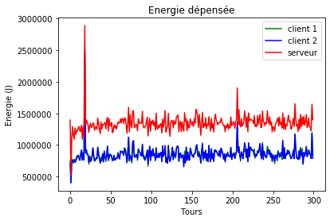
:::

::: {.output .display_data}
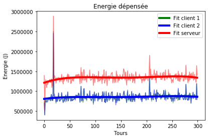
:::
:::

::: {.cell .markdown}
On constate ici aussi que la consommation fluctue beaucoup, mais reste
dans le même ordre de grandeur. La moyenne des clients est de 855 kJ, et
1.34 MJ pour le serveur.\
Cest résultats sont très corrects grâce au dataset **mnist**, on peut
noter une faible consommation énergétique en comparaison avec le dataset
**cifar10**.
:::

::: {.cell .markdown}
### Mxnet + Gluon {#mxnet--gluon}
:::

::: {.cell .markdown}
Notre dernier test utilise l\'outil **mxnet** et le dataset **gluon**.
:::

::: {.cell .code execution_count="74"}
``` {.python}
client = pd.read_csv("mxnet_gluon/result_client.csv",';', usecols=['duration','package_0','core_0','uncore_0'])
serveur = pd.read_csv("mxnet_gluon/result_server.csv",';', usecols=['duration','package_0','core_0','uncore_0'])

graphes(client, serveur)
```

::: {.output .stream .stderr}
    /home/hippo/.local/lib/python3.8/site-packages/IPython/core/interactiveshell.py:3398: FutureWarning: In a future version of pandas all arguments of read_csv except for the argument 'filepath_or_buffer' will be keyword-only.
      exec(code_obj, self.user_global_ns, self.user_ns)
    /home/hippo/.local/lib/python3.8/site-packages/IPython/core/interactiveshell.py:3398: FutureWarning: In a future version of pandas all arguments of read_csv except for the argument 'filepath_or_buffer' will be keyword-only.
      exec(code_obj, self.user_global_ns, self.user_ns)
:::

::: {.output .stream .stdout}
    La Moyenne d'énergie dépensée par le client 1 est de :  782,021.27 Joules
    La Moyenne d'énergie dépensée par le client 2 est de :  771,245.02 Joules
    La Moyenne d'énergie dépensée par le serveur est de :  936,926.55 Joules
:::

::: {.output .display_data}
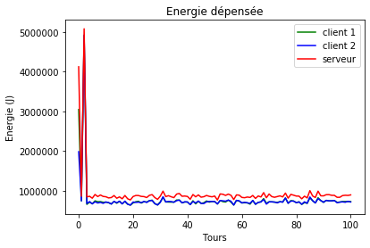
:::

::: {.output .display_data}
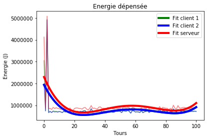
:::
:::

::: {.cell .markdown}
Cette configuration est très peu énergivore aussi, on note que la
moyenne des clients est de 776 kJ, et 936 kJ pour le serveur.
:::

::: {.cell .markdown}
## Conclusion
:::

::: {.cell .markdown}
Avec ces différents tests, on a pu constater que certaines pratiques,
certains outils ou certains datasets sont très énergivores comparé à
certains autres.

1.  L\'outil qui consomme le plus est sans aucun doute **Pytorch** avec
    **Cifar10** qui varie entre 18 et 50 MJ selon les paramètres.\
2.  Ensuite **Tensorflow** avec **Cifar10** consomme de 1 à 10 MJ.\
3.  Puis **Tensorflow** avec **Mnist** consomme entre 850 kJ et 1.35
    MJ.\
4.  Et enfin **Mxnet** avec **Gluon** consomme entre 770 kJ et 940 kJ.
:::

::: {.cell .markdown}
On peut aussi noter que les paramètres comme les **classes**, **epochs**
ou **batch_size** influent grandement sur la consommation.\
Si la taille des **classes** est grande, la consommation diminue de
moitié.\
Si on augmente les **epochs**, la consommation fluctue beaucoup plus,
mais diminue grandement en moyenne.\
Et si on modifie le **batch_size**, c\'est à ce moment là que la
consommation diminue le plus fortement.
:::

::: {.cell .markdown}
```{=html}
<div style="text-align:right;"><strong>Larzul Hippolyte</strong></div>
```
:::

::: {.cell .code}
``` {.python}
```
:::
